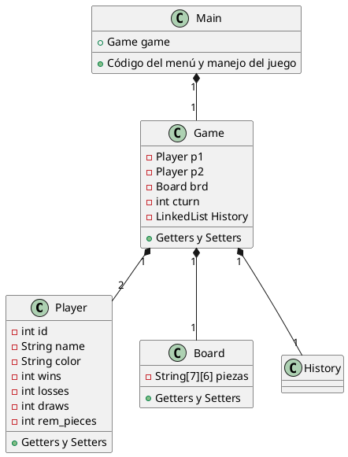
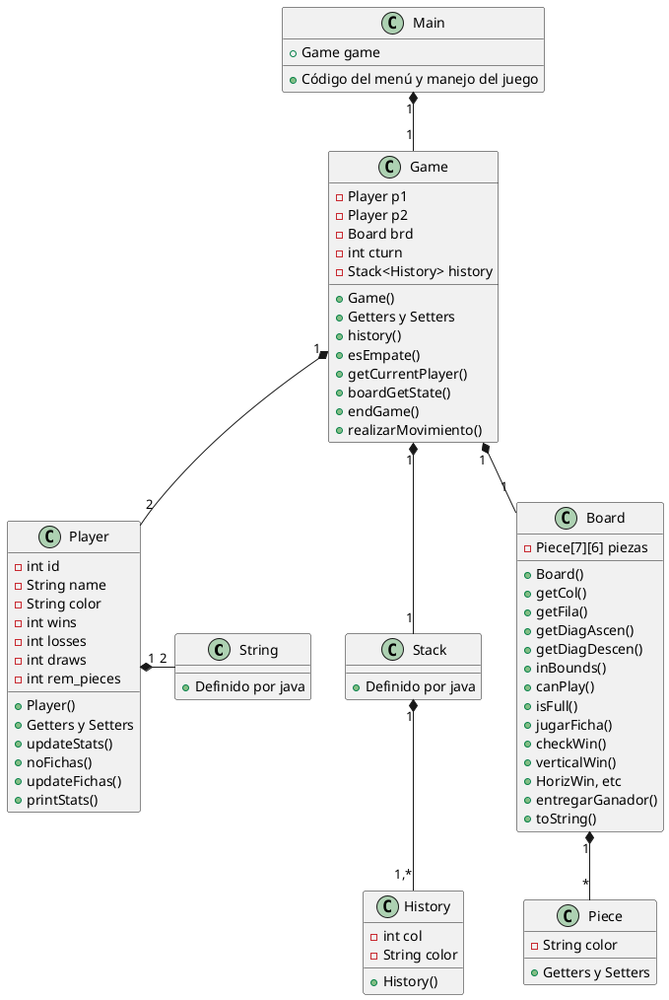
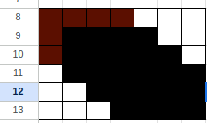
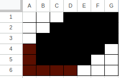
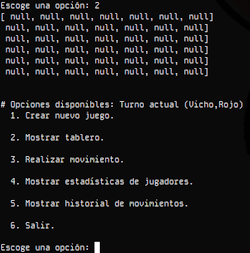

% Laboratorio en Java 
% Vicente Carrasco Álvarez 
% 26/12/24
---
title: Laboratorio en Java
subtitle: Profesor Edmundo Leiva, Sec. A1, Paradigmas de Prog.
date: \today

author: |
  | Vicente Carrasco Alvarez
  | vicente.carrasco@usach.cl
---


# Introducción
El presente informe busca documentar brevemente el análisis, 
diseño, desarrollo, y resultados obtenidos en torno al problema 
propuesto para el Laboratorio 2 de Paradigmas de Programación: 
simular el juego “Conecta4”. Es un juego para niños similar al 3 
en raya, en donde se apilan distintas fichas con tal de hacer 
una línea de 4 fichas iguales para poder ganar una partida.

Este informe está dividido en 4 partes, Introducción, Problema, 
Solución, Instrucciones, Resultados, y Conclusiones. En la 
Introducción se hace una breve descripción del informe y los 
temas tratados en él. En Problema, se hace un análisis del 
problema, mientras que en Solución se muestra el diseño en torno 
a él.Las Instrucciones indican cómo compilar y ejecutar el 
proyecto. En Resultados se evalúan los avances obtenidos en el 
proyecto y se discuten en qué nivel se cumplieron cada uno de 
los requisitos. Por último, en Conclusiones se reflexiona acerca 
del proyecto en sí, comparándolo con la entrega anterior y las 
principales dificultades encontradas en el camino.

Invitamos al lector a ver cada una de las secciones en este 
nuevo formato de informe generado a través de un conversor de 
Markdown a Latex. Esperamos que la lectura sea más apacible a la 
vista, ya que la estructura y la presentación en general son 
mejores que en Word o similares, al menos si comparamos los 
diseños por defecto de cada uno. También deseamos felices 
fiestas.

# Problema
## Descripción breve

El problema consiste en poder simular un juego de Conecta4[@Store_2024], es 
decir, poder hacer las acciones básicas del juego para poder 
hacer una partida y terminarla si es necesario, además de poder 
ver el estado del juego si se requiere. Conecta4 es un juego 
de 2 jugadores donde las fichas se apilan una sobre otra en una 
matriz de 7x6 espacios, y se considera como ganador al jugador 
que logre conectar en raya 4 fichas seguidas, sea en orientación 
horizontal, vertical o diagonal. Los turnos se van alternando 
después de cada jugada, y los jugadores poseen una cantidad 
limitada de fichas al inicio (21 fichas), con 1 color por 
jugador, usualmente rojo y amarillo. 

## Descripción del paradigma

Para este laboratorio es necesario hacer uso de Java para dar 
solución al problema. Este lenguaje es principalmente orientado a 
objetos, es decir, todas las funciones del lenguaje se catalogan 
como objetos pertenecientes a clases que pueden o no ser distintas 
entre sí[@poo2007object]. Del mismo modo, pueden haber clases hijo que hereden 
características de clases padre, o clases que sirvan como molde 
para armar otras. Se enfatiza mucho en este paradigma el uso de 
clases y objetos, ya que permiten abstraer ciertos problemas 
encapsulando las propiedades e interacciones de los mismos mediante 
las distintas categorías.

Los bloques de código de cada método se asemejan ligeramente al 
paradigma procedural (antiguo), ya que históricamente[@foliohistory] este 
nuevo paradigma se implementó como respuesta al antiguo (al 
menos en Java). Es por esto que los bloques for, switch o while 
se asemejan mucho a los de C.

Para este laboratorio se usará Java 11 estándar, es decir, solo 
se hará uso de las librerías incluidas por defecto en la mayoría 
de implementaciones.

## Análisis

Además de simular el juego, la implementación debe cumplir con 
una serie de requisitos funcionales y no funcionales 
especificados en un informe aparte. Dichos requisitos 
especifican las funciones básicas del juego, como sacar una 
pieza, crear un tablero, entre otras.

En esta entrega sí se considera la entrada del usuario, 
mediante un menú estático en la entrada estándar de la terminal. 

El análisis de este laboratorio es, de nuevo, similar al 
anterior, por cambios en la definición de las funciones y los 
requerimientos funcionales y no funcionales de cada una. Se pide 
una serie de requisitos funcionales mínimos (de hecho, solo se 
describen los nombres y casi nada más en el otro informe, a 
diferencia de otros laboratorios) para la implementación, los 
cuales logran cubrir con el funcionamiento básico de un juego de 
Conecta4, es decir, de manera resumida:

* Definir los componentes principales de una partida: los 
Jugadores, el Tablero, las Fichas, el Estado del juego (cuántos 
movimientos se han hecho, cuántos Wins y Losses lleva cada 
jugador, *el menú de interacción con el juego*).

* Implementar las funciones básicas para desarrollar una 
partida, tales como la gestión de los jugadores y del juego, 
colocar fichas en el tablero, etc.

* Añadir funciones específicas, tales como:
 * Crear un jugador, y poder actualizar sus estadísticas (wins, losses, draws, n°de fichas)
 * Crear una ficha
 * Crear un tablero, y añadir fichas en alguna columna
 * Crear un juego, cambiar de turno, y poder terminarlo
 * Poder verificar si alguien ganó un juego, en las distintas orientaciones (vertical, horizontal, diagonal), 
 o ver si hay empate por falta de fichas
 * Mostrar el estado actual de un tablero en pantalla de texto
 * Hacer un historial de los movimientos para el juego
 * Ver si es posible hacer un movimiento en el tablero actual

{ width=250px }

Por otro lado, el menú de interacción no posee mayores 
restricciones, por lo que su diseño y cualidades quedan a libre 
elección del diseñador del programa, mientras permita ver todas 
las funciones antes descritas. Como no se pueden usar librerías 
externas para el manejo de la terminal, el estado del programa 
solo avanzará después de haber leído la entrada correspondiente 
del usuario, es decir, el menú es una parte crítica del programa 
que manejará el bucle de entradas, ejecución y salidas del juego.

El juego en sí sigue siendo simple: debe de haber una matriz de 
fichas, que al estar 4 en raya, actualizan las variables de 
estado del Juego, y las demás acciones deben estar bien 
definidas para que no hayan fallas en los casos borde del 
programa. Hay 2 jugadores y 2 colores; si bien el juego podría 
tener más de estos, la implementación solo considera estas 
condiciones y las demás se dejan sin definir (o quedan acotadas 
en casos borde convenientes, como dejar el juego sin ejecutar un 
cambio, mostrar error en pantalla, etc.). El historial de juego 
solo necesita tener guardados los movimientos de cada jugador en 
su determinada columna, y si bien podría ser usado para deshacer 
y hacer las acciones del juego, no se pide implementarlo (y no 
se implementó).

Por último, los requisitos no funcionales se preocupan de las 
restricciones del problema y la implementación, como no hacer 
uso de variables de estado globales, documentar las entradas y 
salidas de las funciones mediante JavaDoc, el formato de este 
informe, no usar bibliotecas externas de Java, mantener un 
historial del proyecto en GitHub (hacer uso de versionamiento 
por git), seguir la estructura de revisión (tener un menú 
completo) y usar IntelliJ.

# Solución
## Diseño de la solución

Para la solución se escogió el mismo modelo que el anterior 
laboratorio, pero utilizando los conceptos del paradigma 
orientado a objetos vistos en Java.



Si se cumplen con la mayoría de los requisitos al pie de la 
letra, se tiene un juego de Conecta4. Los TDAs son clases concretas,
y sus instancias modelan los datos mínimos necesarios para cada 
función del programa y sus entidades.

En esta iteración de Laboratorios de la asignatura, se optó por 
un diseño más libre de los componentes del sistema, siguiendo 
los principios de encapsulamiento, polimorfismo y 
sobreescritura. Por dar unos ejemplos: si se necesitaba imprimir 
en pantalla un TDA específico, se sobreescribía el método 
toString() del mismo; si se requería una función que hiciera lo 
mismo pero con otras entradas, se defínia un método con el mismo 
nombre pero con similar funcionamiento. Es por esto y a la 
capacidad de manejar el estado del programa mediante objetos que 
no se usaron muchos "wrappers", a diferencia del laboratorio 
anterior.

Pese a ello, la verificación de ganador sigue el mismo esquema del
último laboratorio: vertical, horizontal y diagonal se reducen al
caso base de ver una lista simple de piezas, verificando si hay
4 fichas iguales. No se codificaron por defecto los ganadores,
a diferencia de los laboratorios anteriores.

 

La acción más importante, la de ejecutar un movimiento en el 
juego actual, se implementó de manera en que si se cumplen las 
condiciones de término del juego, este se termina, y en caso 
contrario también actualiza las variables de estado requeridas 
(turno, estadísticas, restar fichas, etc).

Si bien el historial es una pila, la entrada almacenada en ella 
es un TDA simple propio, que almacena la columna y color del 
movimiento.

## Aspectos de la Implementación

Se usó Java 11, con el SDK de openjdk-21 en Ubuntu 24.04 
GNU/Linux, leyendo la documentación de Java 11[@Oracle_2024] como 
referencia.

Los TDAs se guardaron en la carpeta respectiva (tda/), y Main se 
encarga del menú, el cual a su vez crea un juego. Se sigue un 
bucle donde se lee la entrada, se ejecuta el comando 
correspondiente, y se refresca la pantalla de dicho menú.

No se hizo uso de herencia entre los TDA, ni tampoco de 
recursividad. Los otros conceptos del paradigma, como las clases 
abstractas, interfaces, o clases genéricas no se usaron, a 
excepción de las implementaciones correspondientes en la 
librería estándar de Java 11 (```LinkedList<>, Stack<>```, etc).

# Instrucciones de uso

Ejecutar el wrapper de ```gradle``` provisto en ```src``` con las órdenes 
correspondientes para cada sistema: 

En GNU/Linux,*nix:
```
./gradlew build
./gradlew run
``` 

En Windows:
```
gradlew.bat build
gradlew.bat run
``` 



Luego se puede usar el menú siguiendo las instrucciones en 
pantalla. 

Para generar el informe, instalar la última version de pandoc y 
plantuml, y ejecutar las órdenes provistas en el ```README.md``` 
del proyecto.

# Resultados y Autoevaluación

**Se completaron todos los requisitos funcionales, los cuales se 
verifican con la ejecución del programa. No se hicieron pruebas 
extensas del programa, ni al desarrollarlo ni al terminarlo**. 
Es decir, se completó con el diseño mínimo al 100%, excluyendo 
casos bordes. Todas las funciones de un juego se cumplieron.

No se hizo mucho uso de los getters y setters respectivos de 
cada TDA, ya que las funciones de cada uno quedaron bien 
encapsuladas dentro de sí mismos, o por simple descuido al 
usarlos.

# Conclusiones

Como ya ha sido mencionado anteriormente, el modelo de ejecución 
de este laboratorio es similar al anterior. Exceptuando las 
diferencias internas de implementación, el modelo de 
funcionamiento busca tener las mismas funciones básicas de un 
juego. Las limitaciones encontradas fueron mínimas a nivel de 
implementación, puesto que Java es más "sencillo" que Prolog, pero
se hechó de menos el aspecto funcional de Scheme (map, filter) y
la capacidad lógica de Prolog (que permitía razonar más
deductivamente los casos borde, por ejemplo).

Para demostrar lo anterior (Java es más sencillo), se comparan a 
continuación la cantidad de palabras entre los proyectos:
```
> wc Lab1*/*.rkt
>> 1291 (newlines) 4975 (words) total
> wc Lab2*/*.pl
>> 1172 (newlines) 3838 (words) total
>> wc tda/*.java Main.java
>> 1029 (newlines) 2707 (words) total
```

El principal problema de este laboratorio fue la integración con 
las herramientas de desarrollo. El computador del autor 
presentaba problemas de rendimiento y falta de memoria al 
ejecutar el IDE, y las extensas opciones de configuración 
dificultaron la compilación y desarrollo del proyecto, teniendo 
que reiniciar el computador en varias ocasiones. Pese a ello,
se destacan las facilidades de análisis de errores y generación
de código que ofrecía el IDE, que fueron de mucha ayuda. Aún así,
un tercio del proyecto fue escrito desde una terminal.

Nos hubiera gustado implementar un menú interactivo fluido (como 
en un videojuego) en base a librerías como 
ncurses[@E.Dickey](terminal) o SDL[@Latinga_2024], pero las restricciones del 
proyecto impiden usar librerías externas para ello. Sería 
también interesante implementar otras variantes del juego, como 
por ejemplo, un conecta4 cuántico.

# Bibliografía
